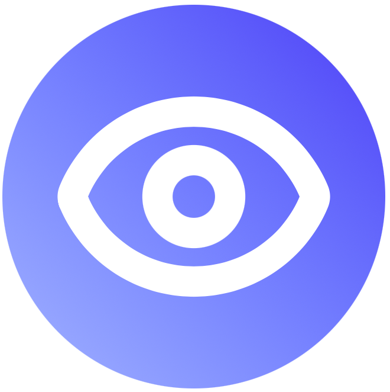

<p align="center">
  
</p>

<h1 align="center">VisionTest</h1>

<p align="center">
  面向人机交互场景的智能视力筛查应用，让日常预防性视力自测更便捷、更高效、更易获得。
</p>

<p align="center">
  <a href="./README.md">English</a> |
  简体中文
</p>

<p align="center">
  
  
  
  
  <a href="https://github.com/Chaotze/VisionTest/blob/master/LICENSE">
    
  </a>
  <a href="https://github.com/Chaotze/VisionTest/tags" rel="nofollow">
    
  </a>
</p>

<p align="center">
  <a href="#项目简介">项目简介</a> |
  <a href="#快速开始">快速开始</a> |
  <a href="#核心功能">核心功能</a> |
  <a href="#工作原理">工作原理</a> |
  <a href="#参与贡献">参与贡献</a>
</p>

> [!IMPORTANT]
> VisionTest 是一款面向日常预防性筛查的自助工具，不能替代专业医疗诊断、医院检查或视光机构验光服务。若结果异常、不稳定，或与日常主观感受明显不符，请及时前往眼科或视光中心进行正规检查。

## 项目简介


VisionTest 是一个结合人机交互设计与计算机视觉能力的智能视力筛查应用，面向学生、办公人群和家庭用户。我们希望利用普通硬件，完成更方便的日常视力监测：一块电脑屏幕，加上一枚摄像头即可开始使用。

我们把传统的 E 字视力表转化为交互式数字体验。它不再依赖固定纸质视力表和固定测试距离，而是通过屏幕 PPI 校准、基于摄像头的人脸测距，以及实时视标尺寸计算，让测试流程更灵活，也更贴近日常居家和办公环境。

## 为什么使用 VisionTest

- 降低日常视力自测门槛，适合宿舍、办公室、家庭环境。
- 减少传统固定距离视力表对空间和摆放条件的要求。
- 支持手势、语音、键盘三种反馈方式，覆盖更多使用场景。
- 单眼测试时可检测是否正确遮挡对应眼睛，提升流程规范性。
- 同时支持浏览器运行和 Wails 桌面封装，便于展示与分发。

## 核心功能

- 根据屏幕 PPI 和用户距离动态缩放 E 字视标。
- 利用摄像头进行人脸跟踪与距离估算。
- 检测单眼测试中的闭眼或遮挡状态，辅助规范测试流程。
- 支持手势、语音、键盘三种作答模式。
- 使用银行卡、校园卡、身份证等实物尺寸完成屏幕 PPI 校准。
- 将 MediaPipe 相关模型和运行资源内置在 `public/mediapipe` 中，方便项目控制与部署。
- 基于 React、Vite、TypeScript、Go、Wails 构建网页与桌面一体化体验。


## 工作原理

1. 用户先通过实体卡片完成屏幕 PPI 校准。
2. MediaPipe Face Landmarker 估算用户与屏幕之间的相对距离。
3. 系统结合测试距离、视力等级和 PPI，实时计算 E 字应显示的物理尺寸。
4. 单眼测试时，系统检测未测试眼是否被正确遮挡或闭合。
5. 用户通过手势、语音或键盘作答，程序按视力等级规则推进测试。

## 快速开始

> [!NOTE]
> 仓库内已配置好代理镜像源，便于在中国大陆的网络环境中快速安装依赖。

### 环境要求

- Node.js 20 及以上
- `pnpm`
- Go 1.25 及以上
- Wails v3 CLI
- 可用摄像头
- 建议使用 Chromium 内核浏览器运行网页版本，尤其在需要语音识别时

### 安装依赖

```bash
pnpm install
```

### 启动网页开发环境

```bash
pnpm dev
```

### 构建前端资源

```bash
pnpm build
```

### 启动桌面开发模式

```bash
wails3 dev
```

### 构建桌面应用

```bash
wails3 build
```

## 使用流程

1. 打开 VisionTest，并授权摄像头权限。
2. 使用银行卡、校园卡或身份证完成屏幕校准。
3. 选择测试眼别和作答方式。
4. 开始测试，按照屏幕或语音提示进行操作。
5. 将结果作为日常预防性参考，而不是临床诊断结论。

## 技术栈

- 视觉能力：MediaPipe Tasks Vision
- 前端：React 19、TypeScript、Vite、Tailwind CSS 4
- UI 相关：Lucide React、Motion、Sonner、Radix 风格组件
- 桌面容器：Wails v3
- 后端运行时：Go

## 项目结构

```text
.
|-- public/                     静态资源与 MediaPipe 模型
|-- src/
|   |-- components/             校准、相机、测试相关界面组件
|   |-- lib/                    视力计算与工具逻辑
|   |-- App.tsx                 应用主入口界面
|-- build/                      Wails 打包与平台构建配置
|-- main.go                     Wails 应用入口
|-- app.go                      Go 应用基础结构
|-- Taskfile.yml                开发与发布任务
|-- package.json                前端脚本与依赖
```

## 精度与适用范围说明

- VisionTest 的定位是预防性自助筛查，不是医疗诊断工具。
- 实际效果会受到摄像头质量、光照、坐姿、屏幕校准精度和浏览器行为影响。
- 语音输入依赖浏览器对 Web Speech 能力的支持情况。
- 测试结果更适合作为日常监测参考，而非医学结论。

## 参与贡献

欢迎围绕筛查流程、交互设计、可访问性和技术精度继续完善项目。

1. Fork 仓库。
2. 新建功能分支。
3. 保持修改聚焦，并清楚说明对用户体验或准确性的影响。
4. 提交 Pull Request，并在合适时附上复现步骤或截图。

## 支持与反馈

- 发现 Bug、异常行为或可复现错误时，请提交 Issue。
- 对交互设计、功能方向或 HCI 改进建议，欢迎通过讨论区或 Issue 交流。
- 若涉及真实视力异常或医学疑问，请优先咨询专业眼科或视光人员，而不是依赖仓库支持。

## 维护者

VisionTest 由 [@Chaotze](https://github.com/Chaotze)、[@Aphrody](https://github.com/Aphrody-Dy)、[@qkq5](https://github.com/qkq5) 共同维护。

## 开源许可

仓库附带的许可证为 GNU Affero General Public License v3.0，详见 [LICENSE](./LICENSE)。

## 致谢

- [MediaPipe Tasks Vision](https://github.com/google-ai-edge/mediapipe)
- [Wails](https://wails.io)
